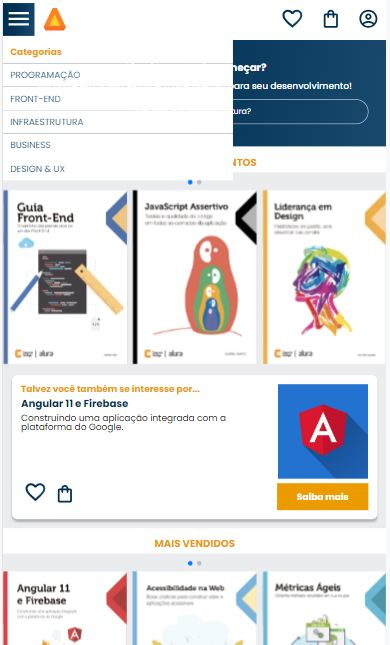

<h1 align="center"> AluraBooks </h1>

Esse é meu primeiro projeto responsivo! ❤️

Esse projeto foi realizado após o curso de Responsividade com mobile-first da Alura.
Nele, foi desenvolvido um site para demonstração de livros de tecnologia, onde tem suas particularidades no celular, tablet e desktop! . 

  <a href="#-tecnologias">Tecnologias</a>&nbsp;&nbsp;&nbsp;|&nbsp;&nbsp;&nbsp;
  <a href="#-projeto">Projeto</a>&nbsp;&nbsp;&nbsp;&nbsp;&nbsp;&nbsp;

 

  
  
  

## 🚀 Tecnologias

Esse projeto foi desenvolvido com as seguintes tecnologias:

- HTML e CSS
- Git e Github

## 💻 Projeto

Pontos importantes do projeto: 

- Criação do menu-hamburguer funcional sem JS
- Input com imagem de pesquisa
- Utilização de Swiper, uma biblioteca externa para criação do carrossel
- Treino de Flexbox
- Media queries/Responsividade - Projeto pensado para Celular, Tablet e Desktops!
- Deploy do projeto final

- [Visite o projeto online](https://d3dd3f.github.io/alurabooks/)
